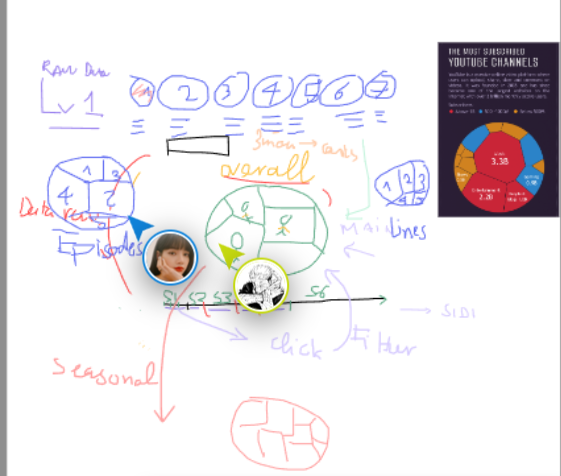
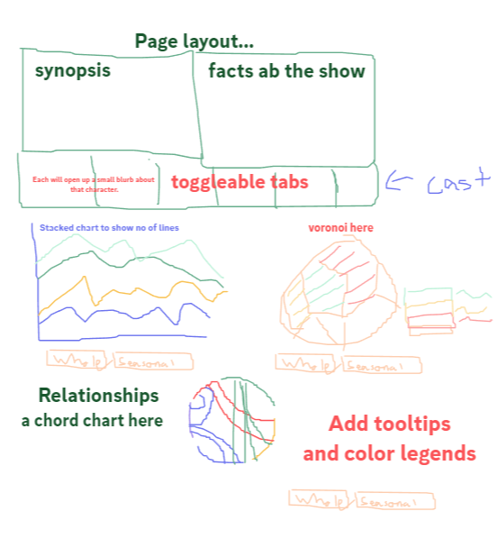
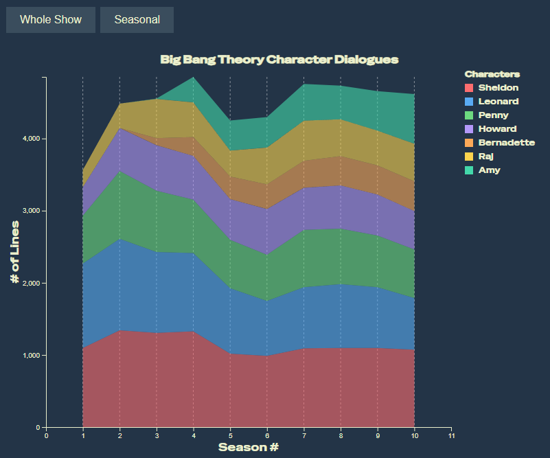
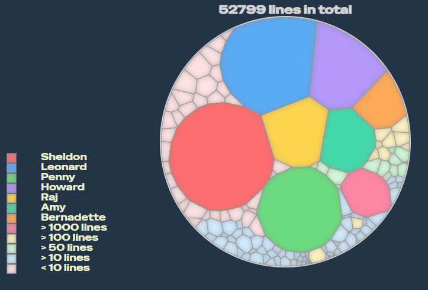
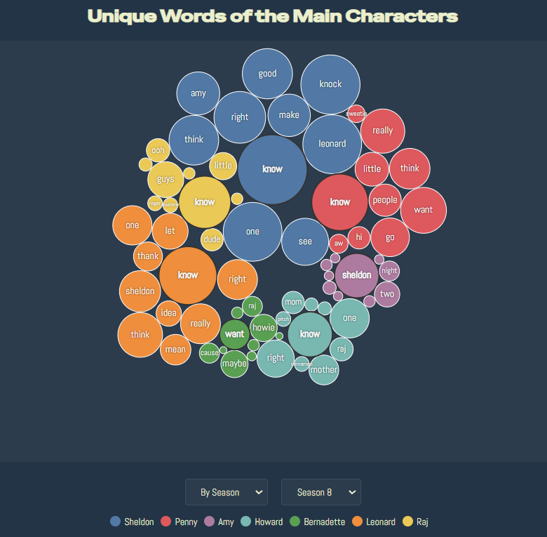
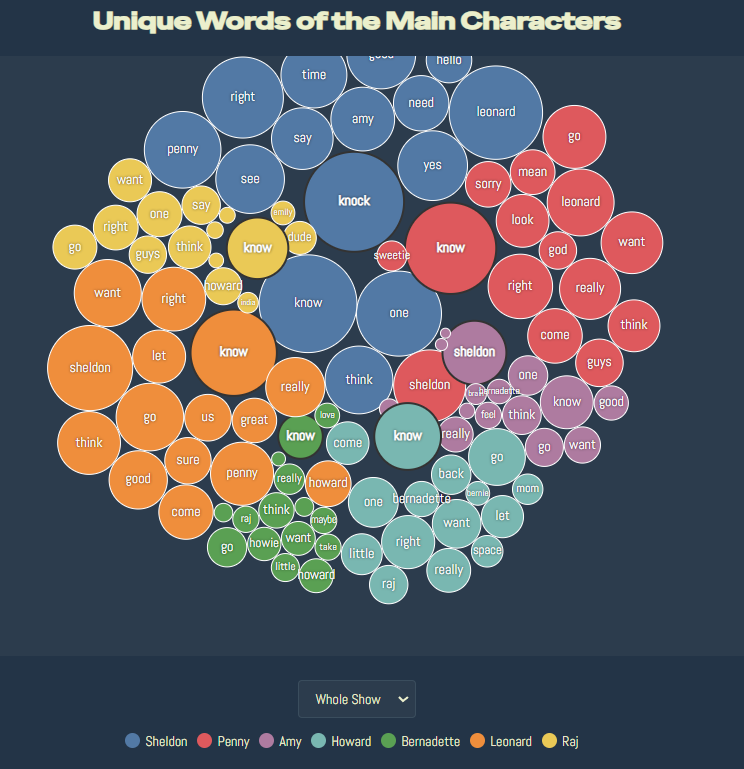

# Data Visualization

# Group 13:

## Project 3: TV shows

## Guideline:

- clone this repo and read the module description

### Team Member:

- Nhat Nguyen
- Long Nguyen
- Du Nguyen

### Project Structure

- `css` folder: stores all the styling files
- `data` folder: stores .csv files
- `images` folder: stores any images used on the page
- `js` folder: stores all the bts `js` code
- `documentation` folder: stores any documentation

### Coordinating plan

- We will meet once a week for updates. We prefer to have in-person meeting during weekday after class or any necessary online meeting after class

- We will used branches for commiting our code to the online code base and will have a code review before merging any branches to main

### Sketches
First Draft...

More detailed

Level 1:
- A little intro header with tabs that introduce each main character
- We really liked the idea of a voronoi map and wanted to include it somewhere in our page, so we incorporated 2 views of showing the number of lines for each character. One is a stacked bar chart, better for seeing the season-to-season changes, and one as a voronoi, better to compare one character against another.

Levels 2 and 3:
- For the word cloud, we went with a bubble chart showing each character's most common word found in their script.
- Since the word cloud already used a bubble view, we went with a chord chart to show the relationship between characters, which we found by making a script that would find dialogues between characters in the same scenes.

Level 4: 
- We went with finding what Penny and Sheldon were discussing most in the show. Since they have a lot of presence together, it'd be interesting to see what they have to say.

### Timeline
- 1 - 13 April: Gathering and Processing Data, making sketches, and experimenting.
- 14 - 20 April: Making the web page. Incorporate charts and visualizations, make necessary changes to the data.
- 20 - 29 April: Finalizing, and turning in the web app.

# Project 2 Documentation

### Data

**Dataset**: 
- [Here](data/raw/big_bang_scripts.csv) is our raw dataset.
- [Here](data/counted) is our scraped data, where we got the line counts.
- [Here](data/voronoi_data) is the data for the voronoi tree map.

**Source**: https://bigbangtrans.wordpress.com

**Important Fields in our data**:
- Episode (Season _ Episode __: Episode Name).
- Dialogue
- Speaker
- Dialogue count

A lot of charts were included in the webpage, and we needed to process a lot of data here. Here we will lay out how we processed it exactly:

1. Collecting raw data.
2. Split into separate seasons for easier parsing.
3. Tallied up total number of dialogues of each character found in the season.
4. Parsed through the dialogue, eliminating words like "I", "and", "or"... to generate word cloud.
5. Kept characters' scores between each other. If they have 2 lines of dialogue right next to each other, directed at each other then that score goes up for the chord chart.

## Visualization Components and Justification
### Show Introduction
A very simple blurb of text that introduces the show, its significance and the main cast. 

- Justification: We figured the best way to get these information out is just by text, and let the rest of our visualizations show more information.

### Stacked Chart
This stacked chart will show the running tally of the lines each of the main cast had throughout the show. This chart can also be changed to show each season in more detail.

- Justification: using a stacked chart like this will help the viewers find certain trends throughout the show.

### Voronoi Tree Map
This chart is a fun way to look at the number of lines each character has!

- Justification: Though this practically shows the same information as the previous chart, we believe that this will offer a more complete look at the entire cast and compare their presences on the show against each other.

### Word Cloud
This shows each of the main character's favorite unique words. Again, viewers can pick between the whole season or viewing each season by themselves to see if the vocabulary changes.
- Justification: we figured that the simplest and most elegant way to show this would just be a simple bubble chart, but allowing for some movement to make it more fun to look at.
 

### Chord Chart
This chart will effectively show the main cast's relationship with each other, with stronger bonds (they just have more dialogue with each other) being thicker and connecting to each other.
- Justification: after some thinking, we went with the chord chart since it was simple and effective in showing this type of relational data we wanted to show.
*INSERT PICTURE HERE*

## Key Findings
- Looking at the stacked chart we can see that whenever a new main character (Amy and Bernadette) debuts there will certainly be a drop in total number of lines for each character! We are faily sure these changes are made to fit all characters within the set time frame for each episode.

- The cast love each other! Looking at our word cloud, we can see that most of the most said words from each character is the name of another character (or themselves). How sweet!

## Technicality
The entirety of our code can be found right here in this repo (https://github.com/huuquangnhatnguyen/DataVisualizationProject3)

## Demo Video

### Work Distribution
We split up the work like so: each person handles a little bit of each level, trying to find things that will help each other progress and slowly get to level 4.

#### Nhat Nguyen:
- Implementing Stacked Chart.
- Process Data for Chord Chart.
- Debugging.

#### Du Nguyen:
- Collected and processed most of the data.
- Main designer.
- Implemented the Voronoi chart and the word cloud.

#### Jack Nguyen
- Documenting.
- Setting up color scheme, app layout and sketching ideas.
- Implemented the Chord Chart.
- Debugging.
